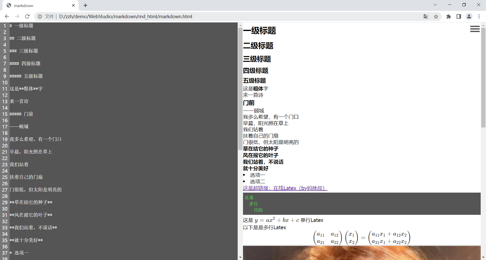
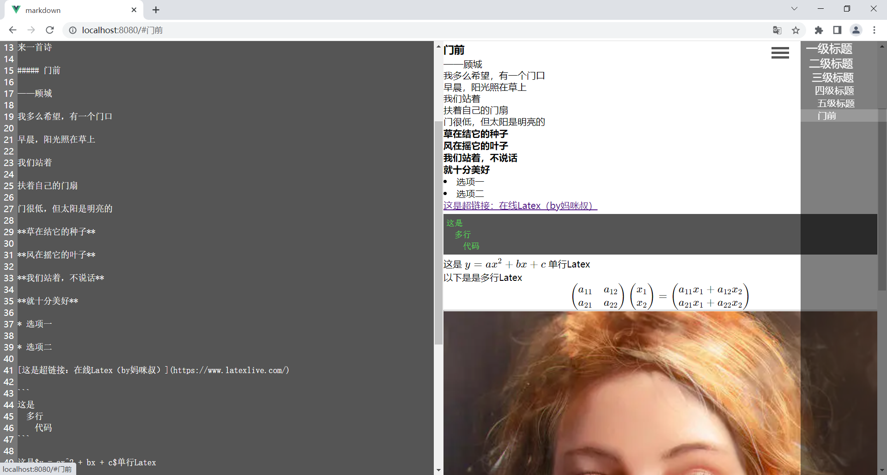

# markdown

From 2018

Update every year

By  Diary_Day

## Project Introduction

This is a Markdown-Web-Edit (include Latex)

It currently support is as follows:

* ```
  ** Bold **
  ```

* ```
  *** Split line
  ```

* ```
  # Primary title
  ```

* ```
  ## Secondary title
  ```

* ```
  ### Tertiary title
  ```

* ```
  #### Four level title
  ```

* ```
  ##### Five level title
  ```

* ```
  [Hyperlinks]()
  ```

* ```
  
  ```

* ```
  `* Option
  ```

* ```
  `Single line code`
  ```

* ```
  ​```
  More lines of code
  ​```
  ```

* ```
  $ Single line Latex $
  ```

* ```
  $$
  More lines of Latex
  $$
  ```

## Project Version

There are 2 version:

* HTML
* Vue2

## Project Pictrue




